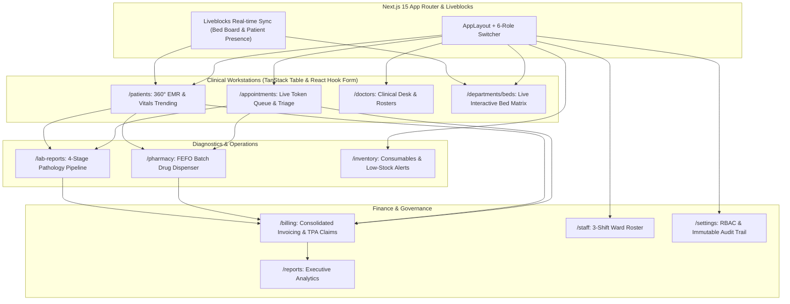

# 🏥 CarePlus — Enterprise Next.js + TypeScript Healthcare ERP Architecture & Roadmap

> **Benchmark Reference:** Enterprise Health Information Systems (Epic Hyperspace, Cerner/Oracle Health, OpenEMR, Practo Ray).  
> **Target Framework:** Next.js 15+ (App Router) + TypeScript + Turbopack.

---

## 🛠️ 1. Technology Curation & Architectural Sanity Check

You requested a broad suite of modern web libraries. Below is the **architectural analysis** of what to adopt, what to avoid, and why:

### 🟢 The Approved Production Stack (Engineered for Healthcare)

| Technology | Category | Role in CarePlus Healthcare ERP |
| :--- | :--- | :--- |
| **Next.js 15+ (App Router) & Turbopack** | Framework & Bundler | Server-side rendering (SSR), Server Components (RSC), API route handlers, and sub-millisecond HMR with Turbopack. |
| **TypeScript** | Language | Strict type-safety across critical healthcare entities (Patients, Lab Biomarkers, Drug Dosages, Invoices). |
| **shadcn/ui + Tailwind CSS + PostCSS** | UI Design System | Accessible Radix UI primitives with zero runtime CSS overhead; fully customizable medical components. |
| **React Hook Form + Zod** | Forms & Clinical Validation | High-performance, un-opinionated forms with strict schema validation for patient triage, prescriptions, and billing. |
| **TanStack Suite (Query & Table)** | Data Grid & Server State | **TanStack Table** powers virtualized, sortable, filterable medical grids (Patients, Drug Batches). **TanStack Query** handles caching, revalidation, and optimistic mutations. |
| **Redux Toolkit (RTK)** | Complex Client State | Manages client-heavy multi-step flows: Active OPD Consultation session, Inpatient Bed Matrix, and Cart/Billing builder. |
| **Liveblocks** | Real-Time Collaboration | **Clinical Presence & Live Sync:** Prevents concurrent edit conflicts when two doctors view the same patient chart; live real-time bed board updates. |
| **Motion One / Framer Motion** | Micro-interactions | Accessible modal transitions, drawer slide-outs, and layout animations. |
| **Lenis** | Smooth Scroll | Smooth scrolling across dense medical timeline views and executive analytics. |
| **Rive / Lottie** | Clinical Animations | Interactive pulse/heartbeat ECG monitors, triage status indicators, and empty-state illustrations. |
| **Swiper.js** | Touch Sliders | Responsive doctor roster carousels, specialty card sliders, and date picker strips. |
| **Axios** | HTTP Client | Centralized API client with JWT refresh token interceptors and error handling. |
| **Cypress** | E2E Testing | End-to-end automated testing for mission-critical paths (e.g. Appointment Booking, Drug Dispensing, Invoicing). |
| **Husky & lint-staged** | Git Hooks & Quality Guard | Pre-commit type-checking (`tsc --noEmit`), ESLint, and Prettier formatting. |
| **WDYR (Why Did You Render)** | Performance Profiler | Development-time tracking to eliminate unnecessary re-renders in heavy patient & lab tables. |

---

### ⚠️ Incompatible / Redundant Libraries (Excluded & Replaced)

1. ❌ **11ty (Eleventy)**:  
   * **Why Excluded:** Eleventy is a standalone Node.js static site generator. Mixing Eleventy with Next.js is redundant because Next.js natively handles Static Site Generation (SSG), Incremental Static Regeneration (ISR), and dynamic Server-Side Rendering (SSR).
2. ❌ **Barba.js**:  
   * **Why Excluded:** Barba.js is designed for traditional multi-page HTML sites (MPAs) using PJAX. In Next.js (which has its own App Router and React Server Components reconciliation), Barba.js breaks router state and hydration.  
   * **Modern Replacement:** Next.js `template.tsx` with **Motion / Framer Motion** provides seamless page transition animations natively.
3. ❌ **Ant Design (antd) + DaisyUI together with shadcn/ui**:  
   * **Why Excluded:** Mixing three different component libraries causes massive CSS specificity conflicts, style bleeding, and unnecessary bundle bloat.  
   * **Decision:** Standardize on **shadcn/ui** (Tailwind + Radix primitives), which produces a clean, accessible, and cohesive healthcare design system.

---

## 🏗️ 2. Next.js App Router Architecture

```
careplus/
├── src/
│   ├── app/
│   │   ├── (auth)/
│   │   │   └── login/page.tsx
│   │   ├── (dashboard)/
│   │   │   ├── layout.tsx                # AppLayout: Sidebar, TopBar, QuickActions, 6-Role Switcher
│   │   │   ├── page.tsx                  # Executive Dashboard Overview
│   │   │   ├── appointments/page.tsx     # Token Queue & Schedule Calendar
│   │   │   ├── patients/
│   │   │   │   ├── page.tsx              # Master Patient Index (TanStack Table)
│   │   │   │   └── [id]/page.tsx         # Patient 360° EMR & Vitals Chart
│   │   │   ├── doctors/page.tsx          # Doctor Directory & Clinical Desks
│   │   │   ├── departments/
│   │   │   │   ├── page.tsx              # Medical Specialties
│   │   │   │   └── beds/page.tsx         # Real-Time Visual Bed Board (Liveblocks sync)
│   │   │   ├── billing/page.tsx          # Multi-Department Invoicing & TPA Claims
│   │   │   ├── pharmacy/page.tsx         # FEFO Drug Batch Inventory & Dispenser
│   │   │   ├── lab-reports/page.tsx      # 4-Stage Diagnostic Test Pipeline
│   │   │   ├── inventory/page.tsx        # Hospital Consumables & Equipment Ledger
│   │   │   ├── staff/page.tsx            # 3-Shift Ward Roster Matrix
│   │   │   ├── reports/page.tsx          # Analytics & CSV/PDF Export
│   │   │   └── settings/page.tsx         # Hospital Profile, RBAC & Immutable Audit Log
│   │   ├── api/                          # Next.js Route Handlers (REST endpoints)
│   │   ├── layout.tsx                    # Root Layout (Fonts, Redux, TanStack Query, Liveblocks Provider)
│   │   └── template.tsx                  # Motion Page Transitions
│   ├── components/
│   │   ├── ui/                           # shadcn/ui primitives (Button, Dialog, Sheet, Table, etc.)
│   │   ├── clinical/                     # TriageModal, EPrescriptionPad, VitalsChart
│   │   ├── layout/                       # Sidebar, TopBar, QuickActionsBar, NotificationsPopover
│   │   └── print/                        # PrintableInvoice, PrintableLabReport
│   ├── store/                            # Redux Toolkit Slices (auth, clinical, bedMatrix, billing)
│   ├── hooks/                            # Custom React & TanStack Query hooks
│   ├── lib/                              # Axios instance, Liveblocks client, utils
│   └── types/                            # Strict TypeScript definitions (patient.ts, doctor.ts, etc.)
├── cypress/                              # E2E test suites
├── .husky/                               # Pre-commit git hooks
└── tailwind.config.ts                    # Design system tokens & clinical color palette
```

---

## 🗺️ 3. Upgraded Production-Grade Feature Mapping


